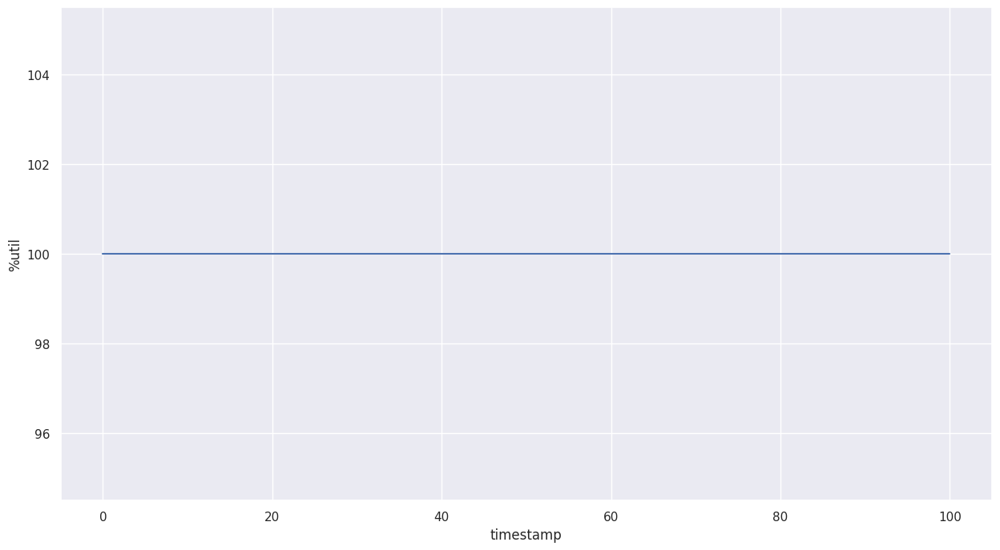
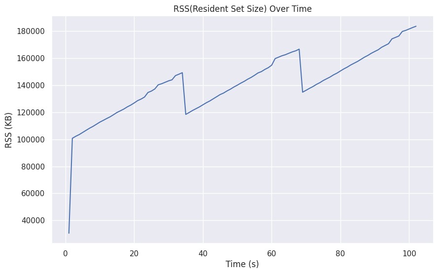
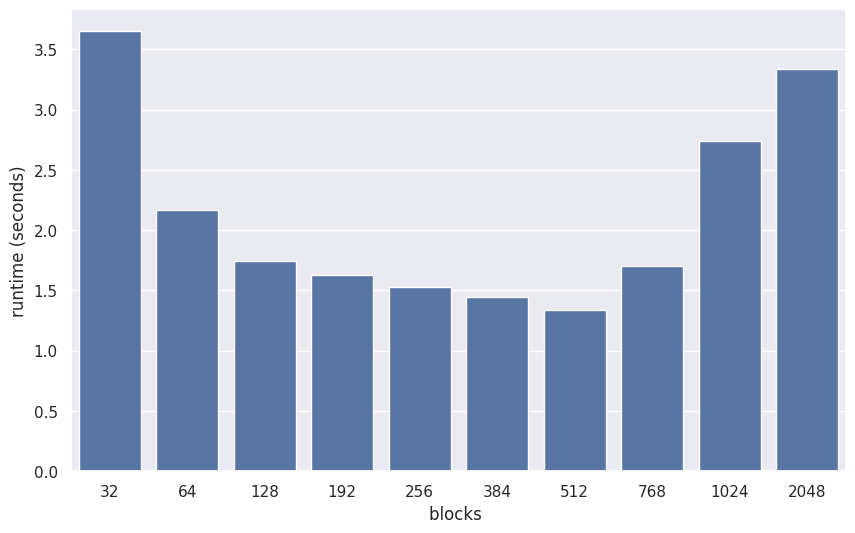

## 性能观测

为了避免云上观测的限制和噪音，我首先使用了一台裸金属服务器 (Intel® Xeon® Silver 4510, 12 cores \*2-socket, max 4.1GHz, 768G memory) 进行性能观测。在初步得出结论后，我在云上进行了验证。

我首先使用了 PIPA 进行生成性能数据采集脚本，基于`ps`, `sar` 和 `perf stat` 进行了性能观测。

CPU Utilization 稳定在 100%



内存使用情况如下



发现随着时间的增长，驻留集（进程当前在物理内存中实际使用的内存量）逐渐上升，考虑存在内存泄漏的可能性。

使用 `perf stat` (使用 Linux 6.12.0-rc6 代码进行重新编译) 进行 TMA 分析： 

```bash
        101,431.35 msec task-clock                       #    1.000 CPUs utilized             
             7,858      context-switches                 #   77.471 /sec                      
                 1      cpu-migrations                   #    0.010 /sec                      
            49,835      page-faults                      #  491.318 /sec                      
   410,731,475,261      cycles                           #    4.049 GHz                       
   207,421,075,436      instructions                     #    0.51  insn per cycle            
    25,969,418,067      branches                         #  256.029 M/sec                     
        12,994,958      branch-misses                    #    0.05% of all branches           
                        TopdownL1                 #     92.5 %  tma_backend_bound      
                                                  #      0.0 %  tma_bad_speculation    
                                                  #      0.2 %  tma_frontend_bound     
                                                  #      7.3 %  tma_retiring           
                        TopdownL2                 #      0.0 %  tma_branch_mispredicts 
                                                  #     18.2 %  tma_core_bound         
                                                  #      0.2 %  tma_fetch_bandwidth    
                                                  #     -0.0 %  tma_fetch_latency      
                                                  #      0.0 %  tma_heavy_operations   
                                                  #      7.3 %  tma_light_operations   
                                                  #      0.0 %  tma_machine_clears     
                                                  #     74.3 %  tma_memory_bound       

     101.434226929 seconds time elapsed

     101.121924000 seconds user
       0.123705000 seconds sys
```

TMA 结果显示主要集中在 `tma_backend_bound` 和 `tma_memory_bound` 上，说明主要的性能瓶颈在于内存访问和计算，考虑到矩阵乘法的计算密集型特性，这也是预期的结果。CPI 高达 2，说明性能可能有较大提升空间。

**结论：这是一个典型的 cpu-intensive 的计算场景。** 考虑进行访存优化和计算优化。

## 代码走读

首先关注主函数

```c
int main()
{
    Initialize();
    
    for (int i = 1; i <= 100; i++) {
        MultiplyOnce(i);
    }

    return 0;
}
```

在主函数中，首先调用了`Initialize` 函数创建并配置一个 Linux 控制组（cgroup），用于限制当前进程的内存使用为 512M。

然后调用了100次`MultiplyOnce`函数，传入参数i，表示当前的乘法次数，实现一次矩阵乘法并测量耗时，其流程如下：

1. 它为四个二维数组分配内存，并确保内存地址按 256 字节对齐。
2. 它调用了 `init_arr` 函数初始化数组 a、b 和 t。`init_arr` 按照 `row * i + col * j + off` 这个公式，对一个 2048 x 2048 的二维 `double` 数组的每个元素进行初始化。
3. 通过调用 `ParallelMultiply` 来利用多线程并行地执行矩阵乘法操作。
   1. 线程数量初始化为 `min(16, cpu_cores)`，其中 `cpu_cores` 通过 `sysconf(_SC_NPROCESSORS_CONF)` 获取，**将会获得Logical CPU数量**。初始化后线程数量递减，最终被设置为能被2048整除的最大值。
   2. `ThreadFunction` 函数是每个线程执行的函数，它计算矩阵乘法的一个子块。它调用的 `mul` 函数最外层 `for (i = tidx; i < msize; i = i + numt)` 分布给了不同的线程进行并行计算。此外，资源清理部分 `// vector_destroy(par->vec);` 被注释掉了，会造成**内存泄漏**。也即，每个线程通过`vector_create()`创建独立的`vector`对象，但没有释放。
4. 使用 `gettimeofday` 函数测量 `ParallelMultiply` 函数的执行时间。
5. 根据 `TRIP_COUNT` 和 `FLOP_PER_ITERATION` 计算浮点运算次数flops和每秒百万浮点运算次数（MFLOPS）。其实这些值均为常量，可以在编译期就完成计算，实际上也没有输出。
6. 使用 `free` 函数释放之前分配的内存。


**结论：这是一个简单的矩阵乘法程序，使用了多线程和 Linux cgroup 来限制内存使用。它通过测量执行时间来评估性能。程序的主要功能是初始化数组、执行矩阵乘法并输出执行时间。**

关于内存泄漏的示意图：

```plainText
每次调用ParallelMultiply
├─ 创建N个线程
│   └─ 每个线程创建1个vector → 累计N个vector未释放
└─ 外层free只释放矩阵内存（a,b,c,t）
```

有趣的是，我使用valgrind进行了内存泄漏检测，发现此处疑似存在漏报。但 RSS 的时序分析已经指出了内存泄漏的问题，代码走读机理分析也可以得出相同的结论，因此我们在这里应当移除`vector_destroy(par->vec);`的注释，以解决内存泄漏问题。

## 性能问题

矩阵乘法运算是一个典型的计算密集型任务，其主要瓶颈在于内存访问和计算。在 CSAPP 第六章中，作者在引入存储器山之后以这个案例对cache和访存相关的性能问题进行了详细的分析。

1. 内存访问缺陷
   1. B矩阵的列主序访问导致缓存利用率低下（cache line利用率仅12.5%） => B矩阵预转置（行列存储顺序转换）/ 矩阵分块
   2. 跨线程内存访问没有对齐（不同线程访问相邻行时缓存争用）=> 内存对齐
2. 线程相关并行化缺陷
   1. 线程频繁创建销毁（ `MultiplyOnce` 循环100次） => 线程池初始化（main函数初始化时创建）
   ```c
   void ParallelMultiply(...) {
    for (tidx = 0; tidx < NTHREADS; tidx++) {
        pthread_create(...); // 每次调用都创建新线程
    }
   }
   ```
   2. 线程数量不合理负载不均衡（当msize % numt != 0时尾部处理缺失） => 动态任务调度（Work-stealing机制）
3. 计算缺陷
   1. 未使用SIMD指令（SSE/AVX） => AVX512指令集应用
   2. 未展开循环（原始代码每个迭代只有1次乘加）=> 循环展开（Unroll Factor建议8）
   3. 未利用寄存器重用（中间结果频繁写内存）
4. 内存管理缺陷
   1. `vector_append` 频繁调用 `realloc` 且初始化内存管理不合理
   2. 内存分配未对齐（影响向量化加载速度）


## 优化

考虑到实验环境为“腾讯云 CVM：标准型 SA5 机型，规格为 2核 4GiB、100GiB 增强型 SSD 云硬盘”。其对应的 CPU model 是 AMD EPYC Bergamo ，其支持 AVX-512 指令集。另外，实验环境只有2个vCPU核，且是虚拟化的环境，可能会影响性能观测。这同时也意味着在程序中线程数量会被分配为2，这对于计算密集型的程序来说，可能由于缓存争用等因素导致性能下降。

由于每次矩阵填充的算法是固定的，如果仅仅需要输入输出保持一致，实际上可以在编译期就完成计算。也即，可以通过类似“打表”的技巧，提前计算好所有可能的输入输出，然后在程序运行时直接查表。这样可以减少运行时的计算量，提高程序的性能。这将会带来极其显著的性能提升，仅需输出提前计算好的结果即可。但是这并不符合性能优化实验的初衷，因此后文不对其进行讨论。


尽管上面列出的问题有很多，但是并不是每一个问题都有必要去解决。例如，在本次测试用例中，线程的数量相当少（最多2个），因此线程的创建和销毁的开销并不会很大。而且，线程的数量也不会对性能产生太大的影响。此外，循环轮次也只有100，规模远远不到因此，我们可以选择不去解决这个问题。我们可以从 perf record 得到的报告数据中得到一定的支持：


```
#         Children              Self  Command   Shared Object     Symbol                                
# ................  ................  ........  ................  ......................................
#
    99.95%  99.87%    99.50%  99.42%  workshop  workshop          [.] mul
            |          
             --24.86%--0x8000000080000000

    24.99%  24.93%     0.00%   0.00%  workshop  [unknown]         [.] 0x8000000080000000
            |
            ---0x8000000080000000

     0.26%   0.26%     0.00%   0.00%  workshop  [kernel.vmlinux]  [k] asm_sysvec_apic_timer_interrupt
     0.24%   0.24%     0.00%   0.00%  workshop  [kernel.vmlinux]  [k] sysvec_apic_timer_interrupt
     0.22%   0.22%     0.00%   0.00%  workshop  [kernel.vmlinux]  [k] __sysvec_apic_timer_interrupt
     0.20%   0.20%     0.00%   0.00%  workshop  [kernel.vmlinux]  [k] hrtimer_interrupt
     0.18%   0.22%     0.02%   0.02%  workshop  [kernel.vmlinux]  [k] asm_exc_page_fault
     0.16%   0.16%     0.00%   0.00%  workshop  [kernel.vmlinux]  [k] __hrtimer_run_queues
     0.16%   0.16%     0.00%   0.00%  workshop  [kernel.vmlinux]  [k] __run_hrtimer
     0.16%   0.16%     0.00%   0.00%  workshop  [kernel.vmlinux]  [k] tick_sched_timer
     0.16%   0.20%     0.01%   0.01%  workshop  [kernel.vmlinux]  [k] exc_page_fault
     0.14%   0.18%     0.00%   0.00%  workshop  [kernel.vmlinux]  [k] handle_mm_fault
     0.13%   0.17%     0.01%   0.01%  workshop  [kernel.vmlinux]  [k] __handle_mm_fault
     0.09%   0.09%     0.00%   0.00%  workshop  [kernel.vmlinux]  [k] tick_sched_handle
     0.09%   0.09%     0.00%   0.00%  workshop  [kernel.vmlinux]  [k] update_process_times
     0.08%   0.08%     0.02%   0.02%  workshop  [kernel.vmlinux]  [k] scheduler_tick
     0.07%   0.07%     0.02%   0.02%  workshop  [kernel.vmlinux]  [k] tick_sched_do_timer
     0.07%   0.07%     0.00%   0.00%  workshop  [kernel.vmlinux]  [k] wp_page_copy
     0.05%   0.05%     0.02%   0.02%  workshop  [kernel.vmlinux]  [k] timekeeping_advance
     0.05%   0.07%     0.05%   0.07%  workshop  [kernel.vmlinux]  [k] sync_regs
     0.05%   0.07%     0.00%   0.00%  workshop  [kernel.vmlinux]  [k] error_entry
     0.04%   0.11%     0.00%   0.00%  workshop  [unknown]         [.] 0000000000000000
     0.04%   0.11%     0.00%   0.01%  workshop  workshop          [.] MultiplyOnce
     0.04%   0.08%     0.04%   0.08%  workshop  [kernel.vmlinux]  [k] clear_page_erms
     0.03%   0.07%     0.00%   0.00%  workshop  [kernel.vmlinux]  [k] __do_huge_pmd_anonymous_page
     0.03%   0.07%     0.00%   0.00%  workshop  [kernel.vmlinux]  [k] clear_huge_page
     0.03%   0.07%     0.00%   0.00%  workshop  [kernel.vmlinux]  [k] clear_subpage.constprop.0
```

在perf report的结果中，99.87% 的 cycles overhead 都在 `mul` 函数中，而 `ParallelMultiply` 函数的开销小于千分之一。因此我们可以选择暂时不去解决这个问题。

由于实验机器的限制（假定两个逻辑核在同一个物理核内），我们本质上需要的是一个高性能的单物理核计算矩阵运算程序。线程相关并行化缺陷的问题可以暂时不去解决。在有需求之后，我们可以考虑上面提到的思路。在这样的场景下，我们应该将线程数调整为1，以避免不必要的线程切换和缓存争用。

另外由于我的测试机器上 libc 的 debuginfo 包有些版本匹配问题，导致无法查看某些符号，但不影响整体分析，我们可以合理推导 0x8000000080000000 个地址指向的符号是 libc 中的 `realloc`。

因此，根据 profiling 的指导，我们可以将主要的注意力集中在 `mul` `vector_append`两个函数上

我们首先针对 `mul` 函数进行分析：

```c
void mul(int msize, int tidx, int numt, Vector *vec, TYPE a[][NUM], TYPE b[][NUM], TYPE c[][NUM], TYPE t[][NUM])
{
    int i,j,k;

    for (i = tidx; i < msize; i = i + numt) {
        for (j = 0; j < msize; j++) {
            for (k = 0; k < msize; k++) {
                c[i][j] = c[i][j] + a[i][k] * b[k][j];
            }
            vector_append(vec, c[i][j]);
        }
    }
}
```

### 重新排列循环以提高空间局部性

对于原始代码来说，我们逐个矩阵分析其访问模式：

- A矩阵访问模式：`a[i][k]` 是 行连续访问 ✅
- B矩阵访问模式：`b[k][j]` 是 列跳跃访问 ❌（每次跨 NUM*sizeof(TYPE) 字节）
- C矩阵访问模式：`c[i][j]` 是 行连续访问 ✅

每次内层循环 k++ 时，B矩阵的访问跨度为 NUM * sizeof(TYPE) 字节，当矩阵较大时（2048x2048），每次访问B矩阵都会触发 cache miss。在本例中，NUM=2048, TYPE=double ，相邻 k 的B元素间隔 16KB（远大于L1d cache line），从而造成缓存不友好。

我们可以通过重新排列循环来提高空间局部性，即将 k 循环放在最外层，从而减少 cache miss。

```
for (k = 0; k < msize; k++) {            // 内积累加维度 
    for (i = tidx; i < msize; i += numt) { // 线程分块维度
        TYPE a_ik = a[i][k]; // 寄存器重用
        for (j = 0; j < msize; j++) {     // 列维度
            c[i][j] += a_ik * b[k][j];    // 连续访问模式 
        }
    }
}
```

- A矩阵访问：`a[i][k]` 仍为行连续 ✅（但循环外提后每个i仅访问1次）
- B矩阵访问：`b[k][j]` 变为行连续 ✅
- C矩阵访问：`c[i][j]` 仍保持行连续 ✅

这样一来，B矩阵访问模式变为空间局部：每次访问 `b[k][j]` 时，j 连续递增，将 `a[i][k]` 存入寄存器，消除内层循环重复访存，每个 `b[k][j]` 也会被所有线程的i循环复用。

L1d缓存行利用率从12.5%提升至100%（每次加载64字节缓存行可完整使用8个double）,每轮k迭代可复用B矩阵的缓存行（L2缓存命中率提升） 可以观测 L1d miss 和 L2 miss 的减少。

### SIMD(AVX512)

lscpu 中 的 flags 显示了 AVX512 的支持，且外层调用中已经考虑了256字节对齐，下一个可以直接带来显著提升的优化点可以考虑 AVX512，修改如下：

1. 使用 _`mm512_set1_pd` 广播标量值到向量寄存器
2. 通过 `_mm512_fmadd_pd` 实现融合乘加（FMA）
3. 每次迭代处理8个双精度浮点数

```c
#include <immintrin.h>

void mul(int msize, int tidx, int numt, Vector *vec, TYPE a[][NUM], TYPE b[][NUM], TYPE c[][NUM], TYPE t[][NUM])
{
    const int VEC_LEN = 8; // AVX512 处理 8 个 double
    int i,j,k;
    
    for (k = 0; k < msize; k++) {
        for (i = tidx; i < msize; i += numt) {
            __m512d a_vec = _mm512_set1_pd(a[i][k]); // 广播标量值
            
            // 主循环处理向量化部分
            for (j = 0; j < msize - (VEC_LEN-1); j += VEC_LEN) {
                __m512d b_vec = _mm512_load_pd(&b[k][j]);     // 对齐加载
                __m512d c_vec = _mm512_load_pd(&c[i][j]);
                c_vec = _mm512_fmadd_pd(a_vec, b_vec, c_vec);
                _mm512_store_pd(&c[i][j], c_vec);            // 对齐存储
            }

            // 处理尾部元素（不足8个）
            for (; j < msize; j++) {
                c[i][j] += a[i][k] * b[k][j];
            }
        }
    }

    // ......
}
```

配套修改编译选项：

```bash
CFLAGS  = -g -mavx512f -O2 -funroll-loops -ffast-math -flto
```


### 分块

当前的循环结构是kij顺序，分块的目标是将这三个维度分成更小的块，以提高缓存利用率。在保持原有的内存访问模式的基础上，通过分块可以减少缓存未命中，好处包括：

- 每个块内的a[i][k]会在BLOCK_SIZE次迭代中复用
- b[k][j]在j维度上的连续访问模式保持不变
- 分块后处理器硬件预取器能更好预测访问模式以预取数据

在上述代码基础上，我们引入了K J两个维度的分块：

```c
    for (int kk = 0; kk < msize; kk += BLOCK_SIZE) {  // K维度分块
        for (int jj = 0; jj < msize; jj += BLOCK_SIZE) {  // J维度分块
            // 块内处理
            for (int k = kk; k < kk + BLOCK_SIZE && k < msize; k++) {
                for (int i = tidx; i < msize; i += numt) {
                    __m512d a_val = _mm512_set1_pd(a[i][k]);
                    
                    // 主向量化部分
                    for (int j = jj; j < jj + BLOCK_SIZE - (VEC_LEN-1); j += VEC_LEN) {
                        if(j >= msize) break;
                        __m512d b_vec = _mm512_load_pd(&b[k][j]);
                        __m512d c_vec = _mm512_load_pd(&c[i][j]);
                        c_vec = _mm512_fmadd_pd(a_val, b_vec, c_vec);
                        _mm512_store_pd(&c[i][j], c_vec);
                    }
                    
                    // 处理块尾部
                    for (int j = jj + BLOCK_SIZE - (BLOCK_SIZE%VEC_LEN); 
                        j < jj + BLOCK_SIZE && j < msize; j++) {
                        c[i][j] += a[i][k] * b[k][j];
                    }
                }
            }
        }
    }
```

结合lscpu的输出：

```bash
  L1d:                    32 KiB (1 instance)
  L1i:                    32 KiB (1 instance)
  L2:                     1 MiB (1 instance)
  L3:                     16 MiB (1 instance)
```

我们可以根据下面的公式对分块大小进行计算：

$$BLOCK\_SIZE_{optimize} = \sqrt( \frac{Cache\_Size}  {3 * sizeof(TYPE)} )$$

- L1d 导向分块
  - $$BLOCK\_SIZE =\sqrt{\frac{32*1024}{3*8}} ≈ 36.5 → 32/64$$
- L2 导向分块
  - $$BLOCK\_SIZE =\sqrt{\frac{1024*1024}{3*8}} ≈ 208 → 128/256 $$
- L3 导向分块
  - $$BLOCK\_SIZE =\sqrt{\frac{16*1024*1024}{3*8}}  ≈ 832 → 512$$

在实践过程中，对多个取值都将进行测试。



结果显示当 BLOCK_SIZE=512 时性能最佳，考虑到 L3 cache 的大小（在云上可能不稳定），512 是一个合理的选择。

理论上可观测到指令缓存压力降低，L1d cache miss 减少，L2 cache miss 减少，L3 cache miss 减少。

### 预分配内存

原始代码中使用的 `vector_append` 初始仅开辟10个int的内存，在本例中，实际各数组使用空间是已知的，在编译期或更早就可以进行计算，这部分开销是可以避免的。我们可以在初始化时预分配内存，避免后续的 `realloc` 调用。

在进行本轮优化后，perf report 中的 `realloc` 调用已经消失，说明vector的内存分配开销已经降低。

```
# Children      Self  Command   Shared Object         Symbol                                        
# ........  ........  ........  ....................  ..............................................
#
    99.27%    98.58%  workshop  workshop              [.] ThreadFunction
            |          
            |--98.58%--start_thread
            |          ThreadFunction
            |          
             --0.68%--ThreadFunction

    99.25%     0.00%  workshop  libc.so.6             [.] start_thread
            |
            ---start_thread
               ThreadFunction
               |          
                --0.55%--asm_exc_page_fault

     0.98%     0.00%  workshop  [kernel.vmlinux]      [k] asm_exc_page_fault
            |
            ---asm_exc_page_fault
               |          
                --0.86%--exc_page_fault
                          |          
                           --0.82%--handle_mm_fault
                                     |          
                                      --0.80%--__handle_mm_fault

     0.86%     0.01%  workshop  [kernel.vmlinux]      [k] exc_page_fault
            |          
             --0.85%--exc_page_fault
                       |          
                        --0.82%--handle_mm_fault
                                  |          
                                   --0.80%--__handle_mm_fault
```

### 编译器参数

- 考虑通过添加编译器参数`-funroll-loops`进行循环展开。
- 使用 `O3` 来启用高阶优化。
- 使用 `-ffast-math` 来启用快速数学运算。
- 使用 `-flto` 来启用链接时优化。


### 转置与其他局部性优化


当前优化后版本虽然改善了B矩阵的访问模式，但仍有提升空间：

```c
c[i][j] += a_val * b[k][j]; // b[k][j] 按行访问但跨行跳跃
```

通过预转置B矩阵，可以将其访问模式转换为连续访问：

```c
c[i][j] += a_val * bt[j][k]; // bt[j][k] 连续访问 
```

而且考虑到矩阵 t 尽管被赋值，但从未被使用过，因此考虑在外层调用中将矩阵t作为矩阵b的转置，以进一步提升对 cache 的友好性。


但是，由于前面的 AVX512 中，我们对kj两个维度进行了分块，所以如果直接进行这样的改动，会导致 cache 的不友好性，在 SPR 机器上的初步结果也显示了时延的劣化，因此，我们需要重新总体考虑循环顺序。

一种方案是 IJK顺序 + K维度向量化，调整循环顺序后，结合转置矩阵 t 的特性：

```c
for (i) {          // I维度连续块
    for (j) {      // J维度分块
        for (k) {  // K维度向量化
            // 对 t[j][k] 的访问是连续的
            __m512d t_vec = _mm512_loadu_pd(&t[j][k]); 
        }
    }
}
```

- `t[j][k]` 的 k 维度在内存中是连续的（转置后），通过向量化一次性加载 ​​8个连续的 k 值​。
- `a[i][k]` 的访问同样是连续的，与 `t[j][k]` 的连续访问完美匹配。

也即，此前我们在 J 维度向量化：

```c
for (j = jj; j < jj + BLOCK_SIZE - 7; j += 8) {
    __m512d b_vec = _mm512_load_pd(&b[k][j]);  // 连续加载 j 维度
    c[i][j] += a[i][k] * b[k][j];
}
```

我们现在要做到在 K 维度向量化：

```c
__m512d acc_vec = _mm512_setzero_pd();
for (k; k + 8 <= k_end; k += 8) {
    __m512d a_vec = _mm512_loadu_pd(&a[i][k]);  // 连续加载 k 维度
    __m512d t_vec = _mm512_loadu_pd(&t[j][k]);  // 连续加载 k 维度
    acc_vec = _mm512_fmadd_pd(a_vec, t_vec, acc_vec); // 水平求和 向量归约
}
```

在此基础上，我们可以进一步对缓存重用进一步优化，分别考虑：

- 将i维度按连续块分配给线程（start到end），而非原代码的跨步访问（i += numt）​​
- `a[i][k]` 的复用​​：对于固定的 i，`a[i][k]` 在多个 j 迭代中被重复使用。
​- `​t[j][k]` 的局部性​​：每个 j 块的 `t[j][k]` 被连续访问，充分利用缓存行。
​- 使用acc累加器暂存结果，单次写回c矩阵，使得结果矩阵 `c[i][j]` 的写入是连续的，避免缓存颠簸。

到这里，已经可以把程序的执行实验控制在秒级了，再结合 GCC O3 优化，我们将可以使得程序获得进一步的优化。

理论上可以观测到 L1d load次数减少，L2 store次数减少

## 云上验证

我对上面的优化分别进行了实验验证，基于多组测量的前提下使用了**几何平均**作为最终结果。原因有二：  
1. 时延数据通常服从对数正态分布（长尾分布），几何平均能更好处理乘性效应；
2. 行业标准实践中广泛使用几何平均，如 SPEC int_rate 采用几何平均

加速比依照下式进行计算：

$$ speedup = \frac{ t_{ori}} { t_{opt}} $$

其中$t_{ori}$ 为原始程序的执行时间，$t_{opt}$ 为优化后的程序的执行时间。


| 名称         |   时间 | 逐级加速比 | 相对原始程序加速比 |
| :----------- | -----: | ---------: | -----------------: |
| 原始代码     | 33.142 |        nan |                  1 |
| 循环重排     |  5.409 |      6.127 |              6.127 |
| AVX512       |  3.299 |       1.64 |             10.047 |
| 512分块      |  1.335 |       2.47 |             24.818 |
| 预分配内存   |  1.336 |      0.999 |             24.806 |
| 编译参数优化 |  1.324 |      1.009 |             25.027 |
| 转置优化     |  1.023 |      1.294 |             32.394 |


## 结语

GEMM(General Matrix Multiply) 是一个非常典型的计算密集型任务，也是 GPGPU 计算的一个重要应用场景。我们在这次的实验中，对于云环境的单核计算矩阵乘法程序进行了优化。最终实现了 32.394 倍的加速比。我们通过对代码的走读分析，结合性能分析工具，找到了代码中的优化点，并实现了相应的优化方案。

由于时间等因素限制，我没有对所有优化进行全面的探索。以下是一些可能的进一步优化方向：

- Strassen算法（本质上是对矩阵分块的再利用，将8次乘法减少至7次，复杂度降至O(n^2.81)）
- 使用更小的类型（如int16_t）来存储矩阵元素（量化）

## reference

1. [How to optimize GEMM on CPU](https://tvm.apache.org/docs/v0.15.0/how_to/optimize_operators/opt_gemm.html)
2. [CSAPP](https://csapp.cs.cmu.edu/3e/home.html)
3. [hxhue's Implementation](https://github.com/hxhue/matrix-multiply-workshop)